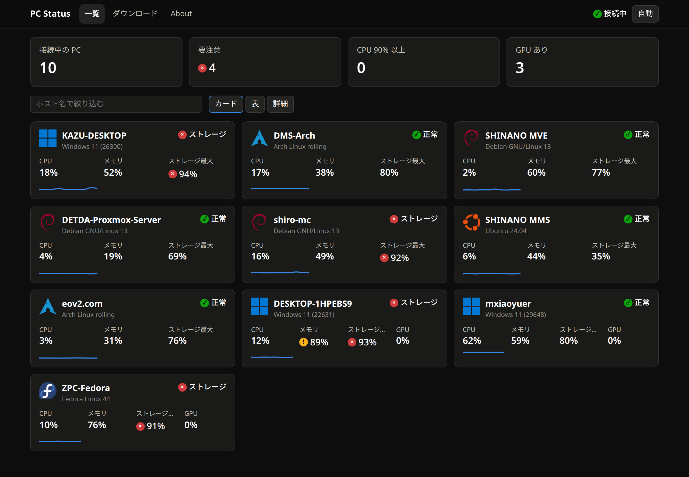
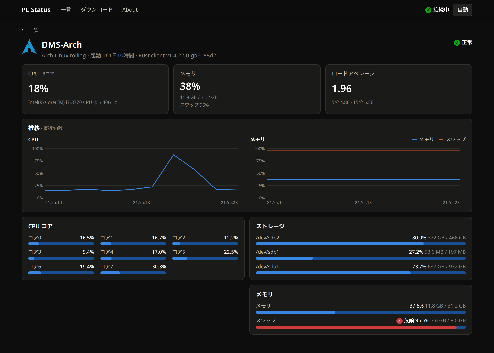
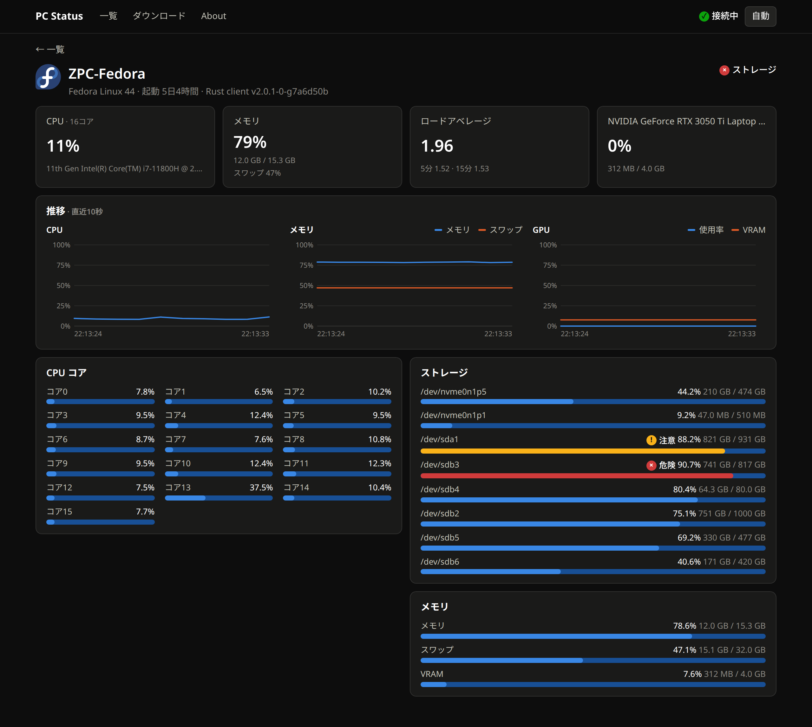

# PC Status Client - Rust

PC の状態を取得し、[PC Status](https://pc-stats.eov2.com/)に送信、表示するツールです。


|  |  |
|---|---|

## 注意

**ツールの性質上、以下の内容が他者に誰でも見られる状態で送信されるため、少しでも不快感を感じる場合は使用しないでください。**\
個人に繋がるような情報は**ホスト名を除き**送信される事はありませんが、必要に応じて PC のホスト名を変更するか、或いは `.env` 内に以下の Key を追加してください。

```env
HOSTNAME=ホスト名として表示させたい文字列
```

## 送信、表示内容

1. PC のホスト名 (e.g. `assault-e5dmts`)
   - ホスト名に個人情報などが含まれている場合は上記[注意](#注意)を参考にホスト名を変更してください。
   - 64 文字まで受け付けますが、32 文字目以降は ... で隠されます。\
     マウスオーバーで全て表示されます。
2. OS のバージョン (e.g. `Windows 10 Home(Windows_NT win32 x64 10.0.19044)` or `Windows 10 (19045)`)
3. CPU 名、CPU 使用率 (全体, コアごと) (e.g. `AMD Ryzen 5 3500 6-Core Processor`)
4. 物理メモリ使用量、スワップメモリ使用量
5. マウントされているストレージ使用量 (実行されている root を参照)
6. GPU 使用率、GPU メモリ使用量 (NVIDIA GPU のみ、複数枚対応)
7. 連続起動時間
8. Load Average (Linux のみ)

## 対応環境

最近の Windows (Server 含む), macOS, Linux であれば動作すると思います。\
もし動作しない場合は [Issues](https://github.com/Zel9278/pcsc-rs/issues) から報告をお願いします。

## 使い方

Linux と macOS は[コマンド1つ](#linux)で、NixOS などの Nix では [flake](#nix) で入れられます。

### Windows

1. [リリースページ](https://github.com/Zel9278/pcsc-rs/releases)から使用する環境に合った最新のリリースをダウンロードしてください。
2. 適当なフォルダに保存し、同じフォルダに `.env` ファイルを作成して以下の Key を追加してください。

```env
PASS=npU7pmkkYfuUdKfqzm2BtDfBPEe4pizrXyPVj8Fby3KaUtehNu3ToDtM8uEdGBr3AS9LRUkZixtZxuKTvsL2e4BVrfzWWG7RqqVThLWsVLHLaJJ8ekeGuHtLBkfZpBtv
```

3. ダウンロードしたリリースを実行してください。
4. [PC Status](https://pc-stats.eov2.com/)にアクセスし、自分の PC が表示されていれば完了です。

必要に応じて `pcsc-rs.exe` のショートカットを `shell:startup` に追加すれば、PC と同時に起動するようになります。

### Linux

下のコマンドで最新のリリースを入れ、systemd に登録して起動します（[install.sh](install.sh)）。以後の更新は pcsc-rs が自分で行います。

```sh
# システム全体（/usr/local/bin、systemd のサービス）
curl -fsSL https://raw.githubusercontent.com/Zel9278/pcsc-rs/main/install.sh | sudo PASS=npU7pmkkYfuUdKfqzm2BtDfBPEe4pizrXyPVj8Fby3KaUtehNu3ToDtM8uEdGBr3AS9LRUkZixtZxuKTvsL2e4BVrfzWWG7RqqVThLWsVLHLaJJ8ekeGuHtLBkfZpBtv sh

# このユーザーだけ（~/.local/bin、systemd --user のサービス。sudo 不要）
curl -fsSL https://raw.githubusercontent.com/Zel9278/pcsc-rs/main/install.sh | PASS=npU7pmkkYfuUdKfqzm2BtDfBPEe4pizrXyPVj8Fby3KaUtehNu3ToDtM8uEdGBr3AS9LRUkZixtZxuKTvsL2e4BVrfzWWG7RqqVThLWsVLHLaJJ8ekeGuHtLBkfZpBtv sh
```

- NixOS ではシステム全体には入れられません（`/etc/systemd` が設定から作られるため）。[Nix](#nix) のモジュールを使ってください。
- 状態は `systemctl status pcsc-rs`（ユーザー版は `systemctl --user status pcsc-rs`）、ログは `journalctl -u pcsc-rs`（ユーザー版は `journalctl --user -u pcsc-rs`）で見られます。
- ユーザー版をログアウト中も動かすには `loginctl enable-linger` が必要です。
- もう一度実行すると、入っているサービスの `PASS` のまま最新版に入れ直します（`PASS=` は省略可）。
- `HOSTNAME` などの[設定](#その他の設定)は、サービスに `Environment="HOSTNAME=…"` を足してください（`sudo systemctl edit pcsc-rs`、ユーザー版は `systemctl --user edit pcsc-rs`）。

<details>
<summary>手動で入れる場合</summary>

`sudo install -D --no-target-directory pcsc-rs-* /usr/local/bin/pcsc-rs` を実行し、Systemd に登録します。\
`sudo --preserve-env=EDITOR systemctl edit --force --full pcsc-rs.service`

```
[Unit]
Description=PCStatus Client
After=network-online.target

[Service]
Environment="PASS=npU7pmkkYfuUdKfqzm2BtDfBPEe4pizrXyPVj8Fby3KaUtehNu3ToDtM8uEdGBr3AS9LRUkZixtZxuKTvsL2e4BVrfzWWG7RqqVThLWsVLHLaJJ8ekeGuHtLBkfZpBtv"
Environment="PCSC_UPDATED=terminate"
ExecStart=/usr/local/bin/pcsc-rs
Restart=always

[Install]
WantedBy=network-online.target
```

```sh
sudo systemctl enable --now pcsc-rs
```

</details>

### macOS

Linux と同じコマンドで最新のリリースを入れ、launchd に登録して起動します。ログイン時に起動し、終了したら（更新のあとも）起動し直します。

```sh
# このユーザーだけ（~/.local/bin、~/Library/LaunchAgents。sudo 不要）
curl -fsSL https://raw.githubusercontent.com/Zel9278/pcsc-rs/main/install.sh | PASS=npU7pmkkYfuUdKfqzm2BtDfBPEe4pizrXyPVj8Fby3KaUtehNu3ToDtM8uEdGBr3AS9LRUkZixtZxuKTvsL2e4BVrfzWWG7RqqVThLWsVLHLaJJ8ekeGuHtLBkfZpBtv sh

# Mac 全体（/usr/local/bin、/Library/LaunchDaemons。ログインしていなくても動く）
curl -fsSL https://raw.githubusercontent.com/Zel9278/pcsc-rs/main/install.sh | sudo PASS=npU7pmkkYfuUdKfqzm2BtDfBPEe4pizrXyPVj8Fby3KaUtehNu3ToDtM8uEdGBr3AS9LRUkZixtZxuKTvsL2e4BVrfzWWG7RqqVThLWsVLHLaJJ8ekeGuHtLBkfZpBtv sh
```

- 状態は `launchctl print gui/$(id -u)/io.github.zel9278.pcsc-rs`（Mac 全体なら `sudo launchctl print system/io.github.zel9278.pcsc-rs`）、ログは `~/Library/Logs/pcsc-rs.log`（Mac 全体なら `/var/log/pcsc-rs.log`）。
- もう一度実行すると、入っている設定の `PASS` と `HOSTNAME`・`DEV_MODE`・`PCSC_URI` のまま最新版に入れ直します。
- `HOSTNAME` などを足すときは、plist に書いてからもう一度実行します。

  ```sh
  plutil -insert EnvironmentVariables.HOSTNAME -string "表示したい名前" ~/Library/LaunchAgents/io.github.zel9278.pcsc-rs.plist
  curl -fsSL https://raw.githubusercontent.com/Zel9278/pcsc-rs/main/install.sh | sh
  ```

- 止めて消すとき: `launchctl bootout gui/$(id -u)/io.github.zel9278.pcsc-rs` のあと、plist と `~/.local/bin/pcsc-rs` を消します。
- ブラウザでダウンロードした実行ファイルを直接使うときは、`chmod +x` と `xattr -d com.apple.quarantine <ファイル名>` が必要です（上のコマンドでは不要）。

### Nix

[flake](flake.nix) でパッケージと、NixOS・nix-darwin・home-manager 用のモジュール（`services.pcsc-rs`）を配っています。Nix で入れた pcsc-rs は自分では更新せず、`nix flake update` などで更新します。

```nix
# flake.nix
{
  inputs.pcsc-rs.url = "github:Zel9278/pcsc-rs";
  inputs.pcsc-rs.inputs.nixpkgs.follows = "nixpkgs";
}
```

```nix
# NixOS（systemd のサービス）: nixosConfigurations.<host>.modules に pcsc-rs.nixosModules.default
# nix-darwin（LaunchDaemon）: darwinConfigurations.<host>.modules に pcsc-rs.darwinModules.default
# home-manager（Linux は systemd --user、macOS は LaunchAgent）: pcsc-rs.homeManagerModules.default
{
  services.pcsc-rs = {
    enable = true;
    # PASS=<パスワード> の1行を書いたファイル。sops-nix や agenix の出力など
    passFile = "/run/secrets/pcsc-rs.env";
    # または pass = "…";（Nix ストアに入り、誰でも読めます）
    # hostname = "表示したい名前";
    # devMode = true;
    # uri = "wss://pcss.eov2.com/server";
  };
}
```

モジュールを使わずに試すだけなら `PASS=… nix run github:Zel9278/pcsc-rs` で動きます。

## その他の設定

- `PCSC_UPDATED`

  更新処理後の動作の設定。新しいリリースの確認は起動時と、起動中は6時間ごとに行います。

  | 値          | 説明                      |
  | ----------- | ------------------------- |
  | `none`      | なにもしない (デフォルト) |
  | `terminate` | 終了する                  |
  | `restart`   | 再起動する                |

- `PCSC_URI`

  接続先のサーバー (デフォルト: `wss://pcss.eov2.com/server`)\
  v2 から WebSocket で接続します。v1 と同じ `https://pcss.eov2.com` のような形でも、`wss://…/server` に読み替えて接続します。

- `DEV_MODE`

  `true` にすると同じホスト名で複数台つなげられます。PC Status には `[DEV] ホスト名_番号` と表示されます。

- `HOSTNAME`

  PC Status に表示するホスト名 (デフォルト: PC のホスト名)
